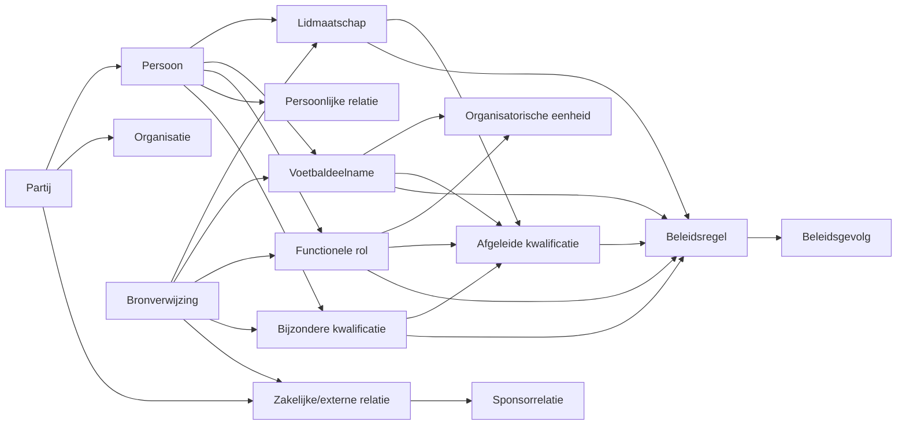

# CKC Logisch Informatiemodel

**Versie:** 0.2  
**Status:** Werkversie / ontwerpbaseline  
**Datum:** 29 augustus 2026  
**Onderdeel van:** Digitaal Verenigingskantoor – Ledenadministratie

## 1. Doel

Het Logisch Informatiemodel (LIM) vertaalt het [CKC Personenmodel](personenmodel.md) naar een samenhangende set logische informatieobjecten.

Het LIM is nog geen fysiek databasemodel. Het legt vast **welke informatie CKC conceptueel moet kunnen beheren**, hoe informatieobjecten samenhangen en welke scheidingen nodig zijn om bronfeiten, afleidingen en beleid zuiver te houden.

De definities en koppeling met bronsystemen worden verder uitgewerkt in het [Gegevenswoordenboek & Bronnenmapping](gegevenswoordenboek-bronnenmapping.md).

## 2. Ontwerpprincipes

1. **Identiteit staat los van relatie.** Een Persoon of Organisatie wordt niet gedefinieerd door zijn actuele rol bij CKC.
2. **Meervoudige rollen zijn normaal.** Eén Persoon kan tegelijkertijd speler, trainer, commissielid en ouder zijn.
3. **Historie wordt expliciet gemodelleerd.**
4. **Bronfeiten, afgeleide kwalificaties en beleidsgevolgen blijven gescheiden.**
5. **Bronsystemen bepalen niet het begrippenmodel.**
6. **Lokale labels worden niet onnodig tot structurele categorie verheven.**
7. **Herleidbaarheid naar de bron is vereist.**

## 3. Informatielagen

### 3.1 Identiteitslaag

Bevat informatie over de Partij zelf:

- Persoon;
- Organisatie;
- contact- en adresgegevens;
- externe identifiers.

### 3.2 Relatielaag

Bevat feiten over de verbinding met CKC:

- Lidmaatschap;
- Voetbaldeelname;
- Functionele rol;
- Persoonlijke relatie;
- Bijzondere kwalificatie;
- Zakelijke/externe relatie;
- Sponsorrelatie.

### 3.3 Afleidingslaag

Bevat reproduceerbare kwalificaties die uit bronfeiten volgen.

Voorbeelden:

- spelend trainer;
- oud-lid;
- actieve vrijwilliger.

### 3.4 Beleidslaag

Bevat beleidsregels en de gevolgen daarvan.

Voorbeelden:

- contributiepositie;
- vrijstelling;
- autorisatie;
- communicatieverplichting.

## 4. Logische informatieobjecten

### 4.1 Partij

Overkoepelend informatieobject voor Persoon en Organisatie.

**Relaties:**

- is Persoon of Organisatie;
- heeft nul of meer relaties met CKC;
- heeft nul of meer contactgegevens;
- kan externe systeemidentificaties hebben.

### 4.2 Persoon

Legt de identiteit van een natuurlijk persoon vast.

**Voorbeelden van gegevens:**

- naam;
- geboortedatum;
- geslacht indien functioneel noodzakelijk;
- adres;
- e-mail;
- telefoon;
- betaalgegevens voor zover noodzakelijk en rechtmatig;
- externe identifiers.

Een Persoon kan bestaan zonder actueel lidmaatschap.

### 4.3 Organisatie

Legt de identiteit van een organisatie of instantie vast.

**Voorbeelden van gegevens:**

- organisatienaam;
- adres;
- contactgegevens;
- registratienummers indien relevant;
- externe identifiers.

### 4.4 Lidmaatschap

Legt een formele lidmaatschapsperiode van een Persoon bij CKC vast.

**Kernaspecten:**

- Persoon;
- begin;
- einde;
- status;
- relevante formele categorie indien van toepassing;
- herkomst/bron.

Meerdere historische lidmaatschapsperioden moeten mogelijk zijn.

### 4.5 Voetbaldeelname

Legt deelname van een Persoon aan voetbal vast, los van het formele lidmaatschap.

**Kernaspecten:**

- Persoon;
- vorm van deelname;
- team/groep indien van toepassing;
- periode;
- competitie/recreatief waar relevant;
- bron.

Dit object voorkomt dat “voetballer zijn” impliciet uit een lidsoort, vrije tekst of teamfunctie moet worden afgeleid.

### 4.6 Functionele rol

Legt vast dat een Persoon gedurende een periode een functie vervult.

**Voorbeelden:**

- trainer;
- teamleider;
- scheidsrechter;
- vrijwilliger;
- commissielid;
- bestuurslid.

Een Functionele rol kan gekoppeld zijn aan een Organisatorische eenheid.

### 4.7 Organisatorische eenheid

Een onderdeel of groep binnen CKC waaraan rollen of deelname kunnen worden gekoppeld.

**Voorbeelden:**

- team;
- commissie;
- bestuur;
- werkgroep.

Lokale namen zoals Oldstars of Vroege Vogels kunnen als naam van een team/groep worden vastgelegd zonder dat zij een aparte lidmaatschapssoort worden.

### 4.8 Persoonlijke relatie

Legt een relatie tussen twee Personen vast voor zover deze voor CKC functioneel relevant is.

**Voorbeelden:**

- ouder van;
- verzorger van;
- contactpersoon voor.

### 4.9 Bijzondere kwalificatie

Legt een expliciet toegekende bijzondere status vast.

**Voorbeelden:**

- erelid;
- lid van verdienste.

Dit is geen vrij tekstveld voor algemene classificatie.

### 4.10 Zakelijke/externe relatie

Legt de relatie tussen CKC en een Partij vast wanneer die niet primair lidmaatschap, voetbaldeelname of een interne functie betreft.

**Voorbeelden:**

- leverancier;
- samenwerkingspartner;
- overheidsrelatie;
- externe instantie.

### 4.11 Sponsorrelatie

Een gespecialiseerde zakelijke relatie voor sponsoring.

Daarbij kunnen onder andere horen:

- sponsor;
- contactpersonen;
- contract;
- afspraken;
- taken;
- facturen.

Sponsit is momenteel een relevante operationele bron voor sponsorgerelateerde informatie.

### 4.12 Afgeleide kwalificatie

Een door regels reproduceerbaar resultaat op basis van bronfeiten.

**Voorbeelden:**

- oud-lid;
- spelend trainer;
- actieve vrijwilliger.

Een afgeleide kwalificatie moet herleidbaar zijn tot de gebruikte bronfeiten en afleidingsregel.

### 4.13 Beleidsregel

Een door CKC vastgestelde regel die bronfeiten en/of afgeleide kwalificaties omzet in een beleidsgevolg.

### 4.14 Beleidsgevolg

Het concrete resultaat van toepassing van een beleidsregel.

**Voorbeelden:**

- contributiecategorie;
- vrijstelling;
- verplichting;
- toegangs- of autorisatierecht.

### 4.15 Bronverwijzing

Legt vast uit welk systeem of welke registratie een bronfeit afkomstig is.

Voorbeelden van bronnen:

- Sportlink;
- CKC Access-database;
- Sponsit;
- inschrijfformulier;
- bestuurs- of verenigingsbesluit;
- toekomstige CKC-database.

## 5. Samenhang

## 6. Voorbeeld: spelend trainer

Een spelend trainer wordt niet als één vast type Persoon opgeslagen.

De registratie bestaat uit:

1. één Persoon;
2. een actueel Lidmaatschap;
3. een actuele Voetbaldeelname;
4. een actuele Functionele rol “trainer”;
5. eventueel een afgeleide kwalificatie “spelend trainer”.

Hierdoor blijven de onderliggende feiten afzonderlijk wijzigbaar en historiseerbaar.

## 7. Voorbeeld: recreant / Oldstars

Een recreatieve speler wordt vastgelegd als:

- Persoon;
- Lidmaatschap;
- Voetbaldeelname met vorm “recreatief”;
- eventueel koppeling aan een Organisatorische eenheid/team met lokale naam “Oldstars”.

Als CKC voor Oldstars een afwijkende contributieregel vaststelt, wordt dat een **Beleidsregel** en niet een nieuwe fundamentele lidmaatschapssoort.

## 8. Voorbeeld: leverancier

Een leverancier kan bestaan uit:

- Organisatie;
- Zakelijke/externe relatie met type “leverancier”;
- één of meer gekoppelde contactpersonen;
- afspraken of andere relevante zakelijke gegevens.

Dezelfde Organisatie kan daarnaast bijvoorbeeld sponsor zijn. Dat leidt tot een tweede relatie, niet tot een duplicaat van de Organisatie.

## 9. Logische kwaliteitsregels

Het toekomstige systeem moet minimaal kunnen bewaken dat:

- één identiteit niet onnodig meerdere keren wordt aangemaakt;
- relaties een geldigheidsperiode kunnen hebben;
- historische lidmaatschapsperioden behouden blijven;
- rollen onafhankelijk van lidmaatschap kunnen bestaan;
- afgeleide kwalificaties reproduceerbaar zijn;
- beleidsgevolgen herleidbaar zijn tot regel en feiten;
- gegevens een bekende bron en waar nodig een autoritatieve bron hebben;
- conflicten tussen bronnen zichtbaar worden gemaakt en niet stilzwijgend worden overschreven.

## 10. Relatie met andere documenten

- [CKC Personenmodel](personenmodel.md) – begrippen en conceptuele relaties.
- [Gegevenswoordenboek & Bronnenmapping](gegevenswoordenboek-bronnenmapping.md) – definities, bronvelden en bronhouderschap.
- `../procesontwerp/ledenadministratie.md` – procescontext voor de ledenadministratie.

## 11. Vervolg naar technisch model

Dit LIM vormt de basis voor latere uitwerking naar:

- attributen en datatypes;
- primaire en externe identifiers;
- cardinaliteiten en constraints;
- historiepatronen;
- API-contracten;
- synchronisatie;
- fysiek PostgreSQL/Supabase-datamodel.

Die technische keuzes worden bewust nog niet in dit document vastgelegd.
