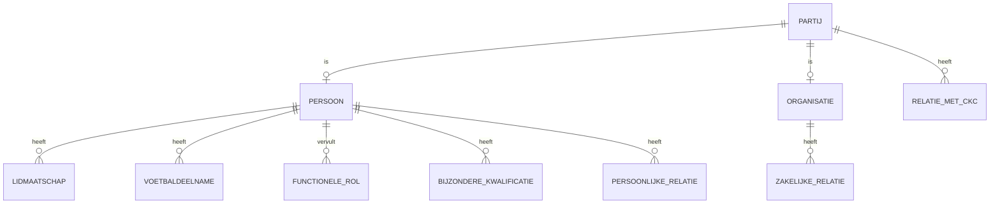

# CKC Personenmodel

**Versie:** 0.2.1  
**Status:** Werkversie / ontwerpbaseline  
**Datum:** 29 augustus 2026  
**Onderdeel van:** Digitaal Verenigingskantoor – Ledenadministratie

## 1. Doel

Het Personenmodel beschrijft welke natuurlijke personen en organisaties voor CKC relevant zijn, welke relaties zij met CKC kunnen hebben en hoe die relaties conceptueel van elkaar worden onderscheiden.

Het model voorkomt dat één technisch veld, één Sportlink-lidsoort of één lokaal label tegelijk wordt gebruikt om verschillende betekenissen vast te leggen.

Dit document beschrijft de **begrippen en relaties**. De verdere structurering van informatieobjecten staat in het [Logisch Informatiemodel](logisch-informatiemodel.md). Definities, bronnen en mappings staan in het [Gegevenswoordenboek & Bronnenmapping](gegevenswoordenboek-bronnenmapping.md).

## 2. Uitgangspunten

1. Een **Persoon** bestaat onafhankelijk van zijn of haar relatie met CKC.
2. Een **Organisatie** bestaat onafhankelijk van haar relatie met CKC.
3. Eén persoon of organisatie kan gelijktijdig meerdere relaties met CKC hebben.
4. Feiten worden zoveel mogelijk los vastgelegd van afgeleide kwalificaties en beleidsgevolgen.
5. Lokale koosnamen of teamnamen zijn niet automatisch afzonderlijke lidmaatschapsvormen.
6. Historie is een zelfstandig vereiste: relaties hebben waar relevant een begin- en einddatum.
7. Externe systemen zoals Sportlink en Sponsit zijn bronnen, geen begrippenmodel.

## 3. Kernbegrippen

### 3.1 Partij

**Partij** is het overkoepelende begrip voor een natuurlijke persoon of organisatie waarmee CKC een relevante relatie kan hebben.

Een Partij is één van:

- **Persoon** – een natuurlijk persoon.
- **Organisatie** – een rechtspersoon, bedrijf, instelling, overheidsorgaan of andere organisatorische eenheid.

### 3.2 Persoon

Een Persoon kan bijvoorbeeld zijn:

- spelend lid;
- recreant;
- trainer;
- teamleider;
- scheidsrechter;
- ouder/verzorger;
- vrijwilliger;
- commissielid;
- bestuurslid;
- oud-lid;
- erelid;
- lid van verdienste;
- contactpersoon van een leverancier of sponsor;
- externe functionaris.

Deze termen zijn **rollen, relaties of kwalificaties** en niet verschillende soorten Persoon.

### 3.3 Organisatie

Een Organisatie kan bijvoorbeeld zijn:

- leverancier;
- sponsor;
- Sportbedrijf Rotterdam;
- gemeente of ander overheidsorgaan;
- KNVB;
- tuchtcommissie of andere externe instantie;
- samenwerkingspartner.

Ook hier geldt dat “leverancier”, “sponsor” of “overheidsorgaan” niet noodzakelijk het identiteitstype van de organisatie is, maar een relatie of rol ten opzichte van CKC.

## 4. Relatie met CKC

Een **Relatie met CKC** legt vast in welke hoedanigheid een Partij met CKC verbonden is of is geweest.

Belangrijke relatiecategorieën zijn:

### 4.1 Lidmaatschap

Een Persoon kan statutair lid van CKC zijn. Het lidmaatschap heeft een eigen levenscyclus en historie.

Bijzondere kwalificaties zoals **erelid** en **lid van verdienste** worden niet gebruikt als vervanging van het lidmaatschap zelf. Zij zijn afzonderlijke kwalificaties die naast het lidmaatschap kunnen bestaan.

### 4.2 Voetbaldeelname

Voetbaldeelname beschrijft dat en hoe een Persoon aan voetbalactiviteiten deelneemt.

Voorbeelden:

- competitiespeler;
- recreatieve speler;
- deelname aan een lokaal recreatief team.

“Oldstars”, “Vroege Vogels” en “Harry’s Voetbalschool” kunnen lokale namen zijn voor recreatieve voetbalactiviteiten. Zij vormen op zichzelf geen afzonderlijke statutaire lidmaatschapssoort.

### 4.3 Functionele rol

Een Persoon kan één of meer functies voor CKC vervullen, bijvoorbeeld:

- trainer;
- teamleider;
- scheidsrechter;
- vrijwilliger;
- commissielid;
- bestuurslid.

Een functie impliceert niet automatisch lidmaatschap. Een trainer kan bijvoorbeeld geen lid zijn, terwijl een spelend trainer zowel lid, voetballer als trainer kan zijn.

### 4.4 Persoonlijke relatie

Een Persoon kan via een andere Persoon aan CKC verbonden zijn, bijvoorbeeld als:

- ouder;
- verzorger;
- ander contactpersoon van een jeugdlid.

Deze relatie maakt de ouder/verzorger niet automatisch lid.

### 4.5 Eer- of bijzondere kwalificatie

Een Persoon kan een door CKC toegekende bijzondere kwalificatie hebben, waaronder:

- erelid;
- lid van verdienste.

De kwalificatie wordt als afzonderlijk feit gemodelleerd en kan beleidsgevolgen hebben.

### 4.6 Zakelijke of externe relatie

Een Persoon of Organisatie kan een zakelijke of institutionele relatie met CKC hebben, bijvoorbeeld:

- leverancier;
- sponsor;
- contactpersoon;
- samenwerkingspartner;
- overheidsrelatie;
- externe functionaris of instantie.

Sponsorgerelateerde gegevens kunnen operationeel in Sponsit worden beheerd, waaronder NAW-gegevens, contracten, facturen, taken en afspraken.

## 5. Bronfeit, afgeleide kwalificatie en beleidsgevolg

Het Personenmodel maakt expliciet onderscheid tussen drie lagen.

### Bronfeit

Een rechtstreeks vastgelegd of uit een gezaghebbende bron overgenomen feit.

Voorbeelden:

- persoon heeft een actief lidmaatschap;
- persoon neemt deel aan recreatief voetbal;
- persoon is trainer van team X;
- persoon is lid van commissie Y;
- organisatie heeft een sponsorcontract;
- persoon heeft de kwalificatie erelid.

### Afgeleide kwalificatie

Een betekenis die uit één of meer bronfeiten wordt afgeleid.

Voorbeelden:

- “spelend trainer” = voetbaldeelname + trainersrol;
- “actieve vrijwilliger” = één of meer actuele vrijwilligersfuncties;
- “oud-lid” = historisch lidmaatschap zonder actueel lidmaatschap.

### Beleidsgevolg

Een gevolg dat CKC op basis van feiten, kwalificaties en beleidsregels toepast.

Voorbeelden:

- contributiecategorie;
- vrijstelling;
- toegangsrecht;
- verplichting tot bepaalde werkzaamheden;
- communicatie- of autorisatieregel.

Een beleidsgevolg mag niet als bronfeit worden teruggeredeneerd.

## 6. Persona-stresstest

| Persona / partij | Modellering |
|---|---|
| Competitiespeler | Persoon + lidmaatschap + competitieve voetbaldeelname |
| Recreant | Persoon + lidmaatschap + recreatieve voetbaldeelname |
| Trainer die geen lid is | Persoon + trainersrol, zonder lidmaatschap |
| Spelend trainer | Persoon + lidmaatschap + voetbaldeelname + trainersrol |
| Ouder van jeugdlid | Persoon + persoonlijke relatie tot jeugdlid |
| Barvrijwilliger | Persoon + vrijwilligersrol; lidmaatschap alleen indien afzonderlijk aanwezig |
| Commissielid | Persoon + commissierol; bij CKC statutair lid indien het CKC-beleid/statuten dat vereisen |
| Oud-lid | Persoon + historisch lidmaatschap; afgeleide kwalificatie “oud-lid” |
| Erelid | Persoon + lidmaatschap/historie + kwalificatie erelid |
| Lid van verdienste | Persoon + lidmaatschap/historie + kwalificatie lid van verdienste |
| Leverancier | Organisatie + leveranciersrelatie; eventueel gekoppelde contactpersonen |
| Sponsor | Organisatie of Persoon + sponsorrelatie + sponsoradministratie |
| Sportbedrijf Rotterdam | Organisatie + relevante externe/zakelijke relatie |
| Burgemeester van Capelle | Persoon + externe/institutionele rol of contactrelatie |
| Tuchtcommissie | Organisatie/organisatorische instantie + externe relatie |

## 7. Relaties op hoofdlijnen

De diagram is conceptueel: technische cardinaliteiten en database-implementatie worden later uitgewerkt.

## 8. Relatie met andere documenten

- [Logisch Informatiemodel](logisch-informatiemodel.md) – vertaalt deze begrippen naar logische informatieobjecten en relaties.
- [Gegevenswoordenboek & Bronnenmapping](gegevenswoordenboek-bronnenmapping.md) – definieert gegevens en legt vast waar brongegevens worden beheerd.
- `../procesontwerp/ledenadministratie.md` – beschrijft het proces waarin een deel van deze informatie wordt gebruikt.

## 9. Openstaande ontwerpvragen

Deze versie is een ontwerpbaseline. Onderwerpen voor verdere detaillering zijn onder meer:

- formele classificatie van lidmaatschapsstatussen;
- precieze modellering van teams, commissies en andere organisatorische eenheden;
- beleidsregels voor contributie en uitzonderingen;
- autoritatieve bron per gegeven;
- historie en geldigheidsperioden;
- technische identifiers en synchronisatie tussen bronsystemen.
